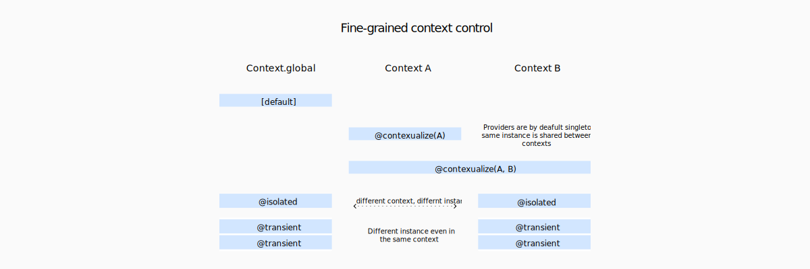

[//]: # (
    DO NOT EDIT THIS FILE DIRECTLY
    run `pnpm run build:docs` to regenerate
  )


<div align='center'></div>


<div align='center'><h3>aspectra</h3></div>


<div align='center'>The decorator framework.</div>


### Introduction


Examples:


- [Basic](https://github.com/shunueda/aspectra/blob/main/examples/basic/index.ts)


<br />


This library provides **stable (stage 3) decorators**. Set the following options in your `tsconfig.json`:


    {
      "experimentalDecorators": false, // or remove this line
      "target": "es2022" // or above
    }


### Features


  |  | utils |
  | - | - |
  | [`provider`](#provider)<br>[`provide`](#provide)<br>[`contextualize`](#contextualize)<br>[`isolated`](#isolated)<br>[`transient`](#transient)<br>[`contexts`](#contexts) | [`application`](#application)<br>[`autobind`](#autobind)<br>[`bound`](#bound)<br>[`main`](#main)<br>[`memoized`](#memoized)<br>[`postconstruct`](#postconstruct)<br>[`sealed`](#sealed)<br>[`singleton`](#singleton) |
  


---


### 


#### `provider`


Registers a class as a provider, allowing it to be injected via
[`@provide`](#provide).


```typescript
@provider
class DatabaseProvider {
  public getAll() {
    // ...
  }
}
```


#### `provide`


Inject a [`@provider`](#provider) into a class field.


> Regardless of how many times it is injected, the same instance will be
> returned each time.


```typescript
class Providers {
  @provide(SampleProvider)
  // notice the `!` for definite assignment
  private readonly provider!: SampleProvider

  // this will be the same instance as the `provider` above
  @provide(SampleProvider)
  private readonly second_provider!: SampleProvider
}
```


#### `contextualize`


Associates a class with one or more specific contexts, enabling contextualized
dependency injection.

When combined with other decorators, this allows for fine-grained control
over the scope of a provider.

<div align='center'>
  
</div>


```typescript
const contextId = 'custom_context'
const otherContextId = 'other_context'

@contextualize(contextId)
@provider
class Provider {}

// Multiple context associations
@contextualize(contextId, otherContextId)
class Consumer {
  // This provider is resolved within the same context as `Provider`
  @provide(Provider)
  public readonly provider!: Provider
}

class OutOfContextConsumer {
  // Fails at runtime as it defaults to the global context,
  // which lacks the `Provider` instance from `custom_context`
  @provide(Provider)
  public readonly provider!: Provider
}
```


#### `isolated`


Marks a provider as `@isolated`, ensuring a unique instance of the provider
is created for each associated context.

Useful for scenarios where the same provider class must yield distinct
instances based on different contexts.


```typescript
@isolated
@provider
class Logger {
  public readonly id = generateId()
}

@contextualize('database')
@provider
class Database {
  @provide(Logger)
  public logger!: Logger // Unique instance for 'database' context
}

@contextualize('printer')
@provider
class Printer {
  @provide(Logger)
  public logger!: Logger // New unique instance for 'printer' context
}
```


#### `transient`


Defines a provider as `@transient`, ensuring a new instance is created
each time the provider is injected.

By default, providers are singletons, meaning a single instance is reused.
With `@transient`, a new instance is created upon each injection, which is
useful for stateless or temporary dependencies.


> The `@transient` decorator differs from `@isolated`:
> - `@transient` creates a new instance each time it’s requested.
> - `@isolated` creates one instance per context, providing the same instance
>   within a given context but different instances across different contexts.


```typescript
@provider
class Provider {}

@transient
@provider
class TransientProvider {}

class Consumer {
  @provide(Provider)
  private readonly provider!: Provider // Singleton instance

  @provide(TransientProvider)
  private readonly transientProvider!: TransientProvider // New instance
}
```


#### `contexts`


Injects the current set of registered contexts into the decorated class field.


```typescript
class Global {
  @contexts
  public readonly contexts!: ReadonlySet<Context> // Global context
}

@contextualize('a', 'b')
class Contextualized {
  @contexts
  public readonly contexts!: ReadonlySet<Context> // 'a' and 'b'
}
```


### utils


#### `application`


Entry point of the application. Will instantiate the class and calls the
`start` method.


```typescript
@application
class Application {
  public start() {
    // ...
  }
}
```


#### `autobind`


Automatically binds all class methods to the instance.


```typescript
@autobind
class Example {
  private readonly name = 'John'

  public greet() {
    console.log(`Hello from ${this.name}`)
  }

  public farewell() {
    console.log(`Goodbye from ${this.name}`)
  }
}

const { greet, farewell } = new Example()
greet() // 'Hello from John'
farewell() // 'Goodbye from John'
```


#### `bound`


Binds a class method to its instance.


```typescript
class Example {
  private readonly name = 'John'

  @bound public greet() {
    console.log(`Hello from ${this.name}`)
  }
}

const { greet } = new Example()
greet() // 'Hello from John'
```


#### `main`


Automatically invokes a decorated method.


```typescript
import { main } from 'aspectra'

class Main {
  @main public static start() {
    console.log('Hello, World!')
  }
}
```


#### `memoized`


Memoizes the method. Usful for optimizing expensive computations.


```typescript
class Calculator {
  @memoized public square(num: number): number {
    console.log('Calculating...')
    return num * num
  }
}

const calculator = new Calculator()
console.log(calculator.square(2)) // Calculating... 4
console.log(calculator.square(2)) // 4
```


#### `postconstruct`


Decorated method is automatically invoked after the class is constructed.


```typescript
class Test {
  @postconstruct public init() {
    console.log('PostConstruct')
  }
}
```


#### `sealed`


Seals a class, preventing it from being extended.


> Error is thrown when attempting to instantiate a derived class.


```typescript
@sealed
class Base {}

class Derived extends Base {}

const instance = new Derived() // throws
```


#### `singleton`


Makes a class singleton, ensuring that only one instance of the class is created.


```typescript
@singleton
class Person {
  public readonly id = Math.random()
}

const john = new Person()
const jane = new Person()

john.id === jane.id // true
```