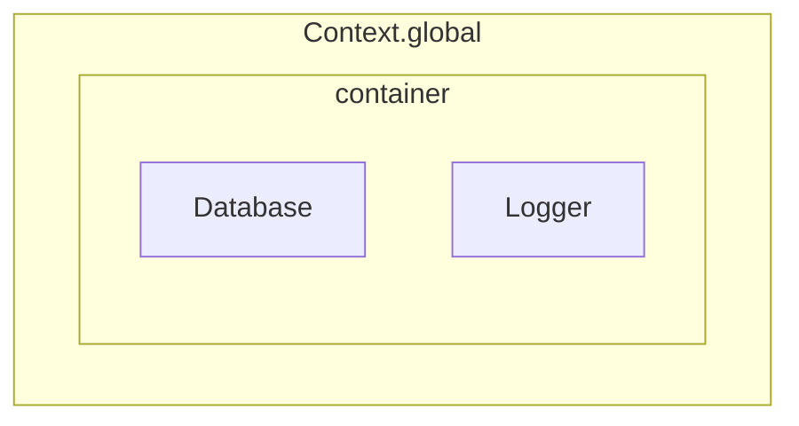

# About Contexts

Contexts are a foundational concept in `aspectra`. By default, each provider is
stored in a global context (accessible via `Context.global{:typescript}`). Each
context includes a container that holds its providers, enabling organized
dependency management.

Providers within the global context can be injected anywhere using `@provide`.
However, you can restrict a provider to a specific context using the
`@contextualize` decorator, which we'll cover next.

